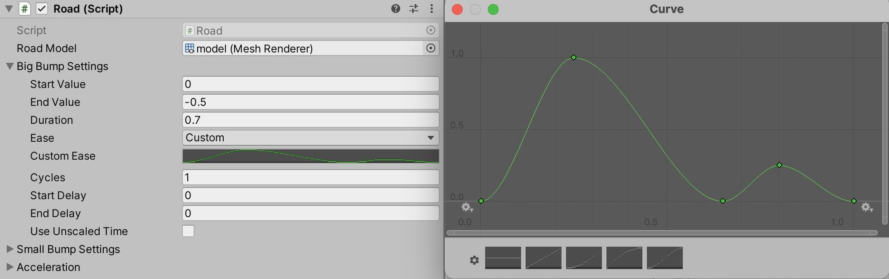
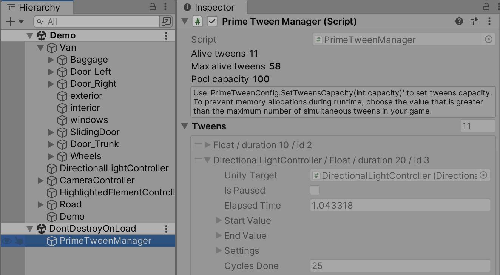
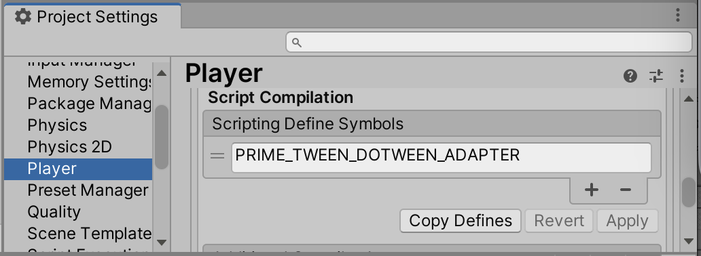

PrimeTween
===

PrimeTween is a high-performance, **allocation-free** animation library for Unity. **Animate anything** with just one line of code, tweak all animation properties directly from the Inspector, and create complex animation sequences. No runtime memory allocations, ever.

[**Performance comparison with other tween libraries.**](https://github.com/KyryloKuzyk/PrimeTween/discussions/10)

**[Asset Store](https://assetstore.unity.com/packages/slug/252960)** | **[Forum](https://discussions.unity.com/t/primetween-high-performance-animations-and-sequences/926420)** | **[FAQ](https://github.com/KyryloKuzyk/PrimeTween/discussions)** | **[YouTube](https://www.youtube.com/watch?v=MuMKwxOzc3M)**

Table of Contents
---
- [Getting started](#getting-started)
  * [Installation](#installation)
  * [Animations](#animations)
  * [Shakes](#shakes)
  * [Callbacks](#callbacks)
  * [Delays](#delays)
  * [Cycles](#cycles)
- [Sequencing tweens](#sequencing-tweens)
  + [Sequence](#sequence)
  + [Coroutines](#coroutines)
  + [Async/await](#asyncawait)
- [Controlling tweens](#controlling-tweens)
- [Inspector integration](#inspector-integration)
- [Custom tweens](#custom-tweens)
- [Advanced](#advanced)
  + [Timescale](#timescale)
  + [OnUpdate](#onupdate)
  + [Speed-based animations](#speed-based-animations)
  + [Custom easing](#custom-easing)
  + [LateUpdate/FixedUpdate](#lateupdatefixedupdate)
  + [Install via Unity Package Manager (UPM)](#install-via-unity-package-manager-upm)
- [Zero allocations with delegates](#zero-allocations-with-delegates)
- [Debugging tweens](#debugging-tweens)
- [Migrating from DOTween to PrimeTween](#migrating-from-dotween-to-primetween)
  + [Performance comparison](#performance-comparison)
  + [DOTween adapter](#dotween-adapter)
  + [Tween.PlayForward/PlayBackwards](#tweenplayforwardplaybackwardsrestart)
  + [Migration cheatsheet](#migration-cheatsheet)
- [Support](#support)

Getting started
---

### Installation
Import PrimeTween from [Asset Store](https://assetstore.unity.com/packages/slug/252960).  
Optional: install via Unity [Package Manager](#install-via-unity-package-manager-upm) (UPM).

### Animations
Without further ado, let's jump straight to the code!
```csharp
using PrimeTween;

// Animate 'transform.position.y' from the current value to 10 in 1 second using the Ease.InOutSine
Tween.PositionY(transform, endValue: 10, duration: 1, ease: Ease.InOutSine);

// Rotate 'transform' from the current rotation to (0, 90, 0) in 1 second
Tween.Rotation(transform, endValue: Quaternion.Euler(0, 90, 0), duration: 1);

// Rotate 'transform' around the y-axis by 360 degrees in 1 second 
Tween.EulerAngles(transform, startValue: Vector3.zero, endValue: new Vector3(0, 360), duration: 1);
```
That's it!

Simply type **`Tween.`** and let your IDE suggest all supported animations. Out of the box, PrimeTween can animate almost everything: UI, UI Toolkit, Materials, Camera properties, Transforms, AudioSource, and whatnot.

Didn't find what you're looking for? No problem, use [`Tween.Custom()`](#custom-tweens) to animate **anything**.
> To view PrimeTween's XML documentation in your IDE, enable this setting: _'Unity Preferences/External Tools/Generate .csproj files for/**Local tarball**'_ and press the _'Regenerate project files'_ button.

### Shakes
```csharp
// Shake the camera with medium strength (0.5f) 
Tween.ShakeCamera(camera, strengthFactor: 0.5f);

// Shake the camera with heavy strength (1.0f) for a duration of 0.5f seconds and a frequency of 10 shakes per second 
Tween.ShakeCamera(camera, strengthFactor: 1.0f, duration: 0.5f, frequency: 10);

// Shake the y-axis position with an amplitude of 1 unit 
Tween.ShakeLocalPosition(transform, strength: new Vector3(0, 1), duration: 1, frequency: 10);

// Shake the z-axis rotation with an amplitude of 15 degrees
Tween.ShakeLocalRotation(transform, strength: new Vector3(0, 0, 15), duration: 1, frequency: 10);

// Punch localPosition in the direction of 'punchDir'
var punchDir = transform.up;
Tween.PunchLocalPosition(transform, strength: punchDir, duration: 0.5f, frequency: 10);
```

### Callbacks
Use **`.OnComplete()`** to execute custom code on tween's completion.
```csharp
// Call SomeMethod() when the animation completes
Tween.Position(transform, endValue: new Vector3(10, 0), duration: 1)
    .OnComplete(() => SomeMethod());
    
// After the animation completes, wait for 0.5 seconds, then destroy the GameObject
Tween.Scale(transform, endValue: 0, duration: 1, endDelay: 0.5f)
    .OnComplete(() => Destroy(gameObject));
```

>"But wait! There is a **memory allocation** in the example above" you would say. And you would be right: calling `SomeMethod()` or `Destroy()` captures `this` reference in a closure and allocates heap memory. See how to address this in the [zero allocations](#zero-allocations-with-delegates) section.

### Delays
Creating delays is by far the most useful feature in game development. Delays in PrimeTween behave like normal tweens and can be used with sequences, coroutines, and async/await methods. All while being completely [allocation-free](#zero-allocations-with-delegates).
```csharp
Tween.Delay(duration: 1f, () => Debug.Log("Delay completed"));
```

### Cycles
Animations can be repeated with the help of cycles. To apply cycles to an animation, pass the `int cycles` and `CycleMode cycleMode` parameters to a `Tween.` method. Setting cycles to -1 will repeat the tween indefinitely.
```csharp
Tween.PositionY(transform, endValue: 10, duration: 0.5f, cycles: 2, cycleMode: CycleMode.Yoyo);
```

To apply cycles to a Sequence, use the `Sequence.Create(cycles: numCycles, cycleMode: CycleMode.Yoyo)` method.
```csharp
Sequence.Create(cycles: 2, CycleMode.Yoyo)
    .Chain(Tween.PositionX(transform, 10, duration))
    .Chain(Tween.PositionY(transform, 20, duration));
```


#### enum CycleMode
- Restart (default): restarts the tween from the beginning.
- Yoyo: animates forth and back, like a yoyo. Easing is the same on the backward cycle.
- Incremental: at the end of a cycle increments the `endValue` by the difference between `startValue` and `endValue`. For example, if a tween moves position.x from 0 to 1, then after the first cycle, the tween will move the position.x from 1 to 2, and so on.
- Rewind: rewinds the tween as if time was reversed. Easing is reversed on the backward cycle.


#### SetRemainingCycles(int cycles)
Sets the number of remaining cycles to an animation. This method modifies the `cyclesTotal` so that the animation will complete after the number of cycles.

#### SetRemainingCycles(bool stopAtEndValue)
Stops an animation when it reaches 'startValue' or 'endValue' for the next time.  
For example, if you have an infinite animation (`cycles == -1`) with CycleMode.Yoyo/Rewind, and you wish to stop it when it reaches the 'endValue', then set `stopAtEndValue` to true. To stop the animation at the 'startValue'  set `stopAtEndValue` to false.

Sequencing tweens
---
### Sequence
There are several sequencing methods in PrimeTween. Let's start with the most common one: grouping tweens in **Sequences**.

**Sequence** is a group of tweens, callbacks, and other sequences. Animations in a sequence can **overlap**, run **sequentially** or in **parallel**, or any combination of those. You can control a Sequence the same way as individual tweens, see [controlling tweens](#controlling-tweens) section.

```csharp
Sequence.Create(cycles: 10, CycleMode.Yoyo)
    // PositionX and Scale tweens are 'grouped', so they will run in parallel
    .Group(Tween.PositionX(transform, endValue: 10f, duration: 1.5f))
    .Group(Tween.Scale(transform, endValue: 2f, duration: 0.5f, startDelay: 1))
    // Rotation tween is 'chained' so it will start when both previous tweens are finished (after 1.5 seconds)
    .Chain(Tween.Rotation(transform, endValue: new Vector3(0f, 0f, 45f), duration: 1f)) 
    .ChainDelay(1)
    .ChainCallback(() => Debug.Log("Sequence cycle completed"))
    // Insert color animation at time of '0.5' seconds
    // Inserted animations overlap with other animations in the sequence
    .Insert(atTime: 0.5f, Tween.Color(image, Color.red, duration: 0.5f));
```

#### Insert(float atTime, Tween/Sequence animation)
Places `animation` inside this sequence at the specified time, **overlapping** with other animations. The total sequence duration is increased if the inserted animation doesn't fit inside the current sequence duration.

#### Chain(Tween/Sequence animation)
Places `animation` after all previously added animations in this sequence. Chained animations run **sequentially** after one another.

#### Group(Tween/Sequence animation)
Groups `animation` with the 'previous' animation in this Sequence. The 'previous' animation is the animation used in the preceding Group/Chain/Insert() method call. Grouped animations start at the same time and run in **parallel**.

### Coroutines
Another sequencing method is waiting for animations in **coroutines** by calling **`.ToYieldInstruction()`**.
```csharp
IEnumerator Coroutine() {
    Tween.PositionX(transform, endValue: 10f, duration: 1.5f);
    yield return Tween.Scale(transform, 2f, 0.5f, startDelay: 1).ToYieldInstruction();
    yield return Tween.Rotation(transform, new Vector3(0f, 0f, 45f), 1f).ToYieldInstruction();
    // Non-allocating alternative to 'yield return new WaitForSeconds(1f)'
    yield return Tween.Delay(1).ToYieldInstruction(); 
    Debug.Log("Sequence completed");
}
```

### Async/await
And the last method is awaiting animations using the **async/await** pattern. Async/await is a great tool to prevent the callback hell in your code. PrimeTween doesn't use threads, so tweens can be awaited on all platforms, even on WebGL.
```csharp
async void AsyncMethod() {
    Tween.PositionX(transform, endValue: 10f, duration: 1.5f);
    await Tween.Scale(transform, endValue: 2f, duration: 0.5f, startDelay: 1);
    await Tween.Rotation(transform, endValue: new Vector3(0f, 0f, 45f), duration: 1f);
    // Non-allocating alternative to 'await Task.Delay(1000)' that doesn't use 'System.Threading'
    // Animations can be awaited on all platforms, even on WebGL
    await Tween.Delay(1); 
    Debug.Log("Sequence completed");
}
```

> While PrimeTween never allocates memory at runtime, the async/await feature in C# is allocating: awaiting an async method allocates a small amount of garbage. Likewise, StartCoroutine() also allocates GC.  
> For performance-intensive code paths, use Sequence instead of async methods and Coroutines.


Controlling tweens
---
All static **`Tween.`** methods return a **`Tween`** struct. While the **`tween.isAlive`** you can control it and access its properties such as duration, elapsedTime, progress, interpolationFactor, etc.

After completion, the tween becomes 'dead' and can't be reused. This ensures that completed tweens don't eat computing resources and prevents the common performance pitfalls encountered in other tween libraries.
```csharp
Tween tween = Tween.LocalPositionX(transform, endValue: 1.5f, duration: 1f);
// ...
 
if (tween.isAlive) {
    // '.isAlive' means the tween was created and not completed (or manually stopped) yet.
    // While the tween '.isAlive' you can access its properties such as duration,
    //     elapsedTime, progress, interpolationFactor, etc.
    Debug.Log($"Animation is still running, elapsed time: {tween.elapsedTime}.");
}

tween.Stop(); // Interrupt the tween, leaving the animated value at the current value
Tween.StopAll(onTarget: transform); // Alternative way to stop the tween by its target

tween.Complete(); // Instantly complete the running tween and set the animated value to the endValue
Tween.CompleteAll(onTarget: transform); // Alternative way to complete the tween by its target

tween.isPaused = true; // Pause the tween
Tween.PausedAll(true, onTarget: transform); // Alternative way to pause the tween by its target

tween.elapsedTime = 0.5f; // Manually set the elapsed time of the tween. Use 'elapsedTimeTotal' to set the elapsed time of all cycles.

tween.progress = 0.5f; // Manually set the normalized progress of the current cycle. This property is similar to the 'normalizedTime' property of the Animation component.

tween.timeScale = 2f; // Apply a custom timeScale to the tween
```

As you can see, there is no way to change the direction of the currently running tween, it can only be **stopped** and **completed**. But how to play an animation **forward** and **backward**, for example, to show or hide a window? Easy! Just start a new Tween in the desired direction.
```csharp
[SerializeField] RectTransform window;

public void SetWindowOpened(bool isOpened) {
    Tween.UIAnchoredPositionY(window, endValue: isOpened ? 0 : -500, duration: 0.5f);
}
```
In this example, the `SetWindowOpened()` can be called again while the previous animation is still running. Generally, there is no need to stop the previously running tween in such cases. The new tween will seamlessly start from the current position and **overwrite** all previously running tweens on the `window`. Several duplicated tweens are fine, but if your code can potentially create duplicated tweens every frame, then consider stopping the previous tween with the help of `tween.Stop()` or `Tween.StopAll(onTarget: target)`.

Inspector integration
---
Inspector integration is the cornerstone of PrimeTween's design. It lets you tweak all animation properties from the Inspector without changing the code. It **saves time** and gives **creative freedom**. All animation settings can be **serialized** in MonoBehaviour or ScriptableObject and passed to the corresponding Tween methods.
```csharp
// Tweak all animation properties from the Inspector:
//     startValue, endValue, duration, ease (or custom ease curve), etc.
[SerializeField] TweenSettings<float> yPositionTweenSettings;
// Then pass tween settings to the animation method
Tween.PositionY(transform, yPositionTweenSettings);

[SerializeField] TweenSettings<Vector3> rotationTweenSettings;
Tween.Rotation(transform, rotationTweenSettings);

[SerializeField] TweenSettings<Vector3> eulerAnglesTweenSettings;
Tween.EulerAngles(transform, eulerAnglesTweenSettings);

[SerializeField] ShakeSettings cameraShakeSettings;
Tween.ShakeLocalPosition(Camera.main.transform, cameraShakeSettings);
```
The neat thing about setting up animation properties in the Inspector is that you can any time switch to a custom **animation curve** without touching the code.



Now let's revisit the window example from the [Controlling tweens](#controlling-tweens) section and improve it by removing all magic variables from the code. Notice how the **`isOpened`** parameter is passed to the **`WithDirection(bool toEndValue)`** method. This helper method selects the target position based on the `isOpened` parameter. Nice and simple!

<details>
<summary>Old window example (click to expand)</summary>

```csharp
[SerializeField] RectTransform window;

public void SetWindowOpened(bool isOpened) {
    Tween.UIAnchoredPositionY(window, endValue: isOpened ? 0 : -500, duration: 0.5f);
}
```
</details>


Window example with Inspector Integration:
```csharp
[SerializeField] RectTransform window;
[SerializeField] TweenSettings<float> windowAnimationSettings;

public void SetWindowOpened(bool isOpened) {
    Tween.UIAnchoredPositionY(window, windowAnimationSettings.WithDirection(toEndValue: isOpened));
}
```

> The generic TweenSettings<T> can be serialized and tweaked from the Inspector in Unity 2020.1+. If you're using an older version of Unity, use the non-generic TweenSetting and serialize `startValue/endValue` separately.

Custom tweens
---
Use **`Tween.Custom()`** to animate literary anything. The supported types for custom tweens are `float, Color, Vector2/3/4, Quaternion, and Rect`.
```csharp
float floatField;
Color colorField;

// Animate 'floatField' from 0 to 10 in 1 second
Tween.Custom(0, 10, duration: 1, onValueChange: newVal => floatField = newVal);

// Animate 'colorField' from white to black in 1 second
Tween.Custom(Color.white, Color.black, duration: 1, onValueChange: newVal => colorField = newVal);
```

As you may expect, custom tweens work with [inspector integration](#inspector-integration) the same way as regular tweens do.
```csharp
[SerializeField] TweenSettings<float> tweenSettings;
float floatField;

Tween.Custom(tweenSettings, onValueChange: newVal => floatField = newVal);    
```

Advanced
---

### Timescale
You can apply a custom timeScale to each individual animation with the help of the `timeScale` property.

To smoothly animate the timeScale, use `Tween.TweenTimeScale(Tween/Sequence tween, ...)` method.  
To animate the global Unity's Time.timeScale, use `Tween.GlobalTimeScale(...)` method.

### OnUpdate
Use `tween.OnUpdate()` callback to execute a custom callback when the animated value is updated.
```csharp
// Rotate the transform around the y-axis as the animation progresses
Tween.PositionY(transform, endValue, duration)
    .OnUpdate(target: transform, (target, tween) => target.rotation = Quaternion.Euler(0, tween.interpolationFactor * 90f, 0));

// Call the OnPositionUpdated() method on every position change
Tween.PositionY(transform, endValue, duration)
    .OnUpdate(target: this, (target, tween) => target.OnPositionUpdated(tween.progress));
```

### Speed-based animations
Tween._**AtSpeed**(transform, endValue, **speed**, ...) methods allow to create animations based on the speed instead of duration. When the speed-based tween is created, PrimeTween will calculate the duration with the help of a simple formula: `duration = distance(startValue, endValue) / speed`. Because the duration is calculated immediately, to chain speed-based tweens to one another, you have to specify the `startValue` for all subsequent tweens:
```csharp
Tween.LocalPositionAtSpeed(transform, endValue: midPos, speed)
    // Set 'startValue: midPos' to continue the movement from the 'midPos' instead of the initial 'transform.position'
    .Chain(Tween.LocalPositionAtSpeed(transform, startValue: midPos, endValue: endPos, speed));
```

### Custom easing
#### Animation curves
It's possible to pass AnimationCurve instead of Ease enum to tweening methods:
```csharp
AnimationCurve animationCurve = AnimationCurve.EaseInOut(0, 0, 1, 1);
Tween.PositionY(transform, endValue, duration, animationCurve);
```
#### Parametric easing
Parametric easing gives the ability to customize the standard ease types. For example:
```csharp
// Regardless of the current position and endValue, the bounce will have the exact amplitude of 1 meter 
Tween.PositionY(transform, endValue, duration, Easing.BounceExact(1));
```

Available parametric eases:
- Easing.Overshoot(float strength): customizes the overshoot strength of Ease.OutBack.
- Easing.Bounce(float strength): customizes the bounce strength of Ease.OutBounce.
- Easing.BounceExact(float amplitude): customizes the exact amplitude of the first bounce in meters/angles.
- Easing.Elastic(float strength, float period = 0.3f): customizes the strength and oscillation period of Ease.OutElastic.

### LateUpdate/FixedUpdate
Use `updateType` parameter to chose which Unity even function will update the animation. The available options are Update, LateUpdate, and FixedUpdate.  
```csharp
// Use TweenSettings or TweenSettings<T> struct to pass the 'updateType' parameter to static 'Tween.' methods
Tween.PositionX(transform, endValue: 10f, new TweenSettings(duration: 1f, updateType: UpdateType.LateUpdate));

var tweenSettingsFloat = new TweenSettings<float>(endValue: 10f, duration: 1f, updateType: UpdateType.FixedUpdate);
Tween.PositionX(transform, tweenSettingsFloat);

// To update the Sequence in FixedUpdate(), pass the 'updateType' parameter to Sequence.Create()  
Sequence.Create(updateType: UpdateType.FixedUpdate);
```

### Install via Unity Package Manager (UPM)
The Package Manager installation method allows to include PrimeTween in derivative (free and commercial) projects (templates, libraries, GitHub repositories). For more info, see the [license](https://github.com/KyryloKuzyk/PrimeTween?tab=License-1-ov-file).  
This installation method also helps to clean the project structure.
- Open 'Edit / Project Settings / Package Manager'.
- Add a new Scoped Registry with Name: `npm` URL: `https://registry.npmjs.org` Scope(s): `com.kyrylokuzyk`.
- Go to 'Window / Package Manager / Packages / My Registries'.
- Install the PrimeTween package.
  
Or modify the `Packages/manifest.json' file manually:
```json
{
  "dependencies": {
    "com.kyrylokuzyk.primetween": "1.3.1",
    ...
  },
  "scopedRegistries": [
    {
      "name": "npm",
      "url": "https://registry.npmjs.org/",
      "scopes": [
        "com.kyrylokuzyk"
      ]
    }
  ]
}
``` 

Zero allocations with delegates
---
C# delegates is a powerful language feature essential for game development. It gives us the ability to receive callbacks and pass methods to other methods. But when delegates are used in hot code paths carelessly, they can create [performance issues](https://www.jacksondunstan.com/articles/3765).

Let's review the code from earlier. If SomeMethod() is an instance method, then calling it from the callback will implicitly capture **`this`** reference, allocating heap memory.
```csharp
Tween.Position(transform, new Vector3(10, 0), duration: 1)
    .OnComplete(() => SomeMethod()); // delegate allocation!
```

Here is how to fix the above code to be non-allocating. Notice how **`this`** reference is passed to the `OnComplete` method, then the **`target`** parameter is used instead of calling `SomeMethod()` directly.
```csharp
Tween.Position(transform, new Vector3(10, 0), duration: 1)
    .OnComplete(target: this, target => target.SomeMethod()); // no allocation
```

That's it! The same non-allocating approach can be used in all places where PrimeTween uses delegates.
```csharp
Tween.Delay(this, duration: 1f, target => target.SomeMethod());

Tween.Custom(this, 0, 10, duration: 1, (target, newVal) => target.floatField = newVal);

var shakeSettings = new ShakeSettings(frequency: 10, strength: Vector3.one, duration: 1);
Tween.ShakeCustom(this, startValue: vector3Field, shakeSettings, (target, val) => target.vector3Field = val);
```

Debugging tweens
---
To debug tweens select the **PrimeTweenManager** object under the DontDestroyOnLoad foldout in the scene Hierarchy. Here you can inspect all currently running tweens and their properties.

If the tween's `target` is `UnityEngine.Object`, you can quickly show it in the Hierarchy by clicking on the `Unity Target` field. This is a good reason to supply the target even when it's optional, like in the case of `Tween.Delay()` and `Tween.Custom()`.



Also, the Inspector shows the '**Max alive tweens**' for the current session. Use this number to estimate the maximum number of tweens required for your game and pass it to the `PrimeTweenConfig.SetTweensCapacity(int capacity)` method at the launch of your game. This will ensure PrimeTween doesn't allocate any additional memory at runtime.

Migrating from DOTween to PrimeTween
---
PrimeTween and DOTween don't conflict with each other and can be used in one project. You can check out all PrimeTween's performance benefits in your current DOTween project without breaking anything.

What are the reasons to try PrimeTween?
* See [performance](https://github.com/KyryloKuzyk/PrimeTween/discussions/10) comparison.
* **Seamless installation** that never produces compilation errors regardless of what other packages or plugins your project already uses.
* PrimeTween is extremely easy to learn. It has only 8 top-level concepts, and you can learn the API even without the documentation by simply typing `PrimeTween` and pressing `.`
* PrimeTween is extensively covered by more than **250 automatic tests** that ensure that every bit works perfectly.
* With PrimeTween it's safe to [destroy objects](https://github.com/KyryloKuzyk/PrimeTween/discussions/4) with running animations.
* PrimeTween is truly multiplatform with no exceptions. Awaiting tweens in async methods works even on WebGL!

#### Performance comparison

Please visit the full performance comparison [article](https://github.com/KyryloKuzyk/PrimeTween/discussions/10).

#### DOTween adapter

PrimeTween comes with a built-in migration adapter that can help you migrate even big projects relatively quickly. The adapter can also be used if you're missing extension methods you've gotten used to.

The Adapter is an **optional** feature designed to speed up PrimeTween's adoption. The migrated code may still be allocating because of the [delegate allocations](#zero-allocations-with-delegates).
> Please **back up** your project before proceeding. You should **test** the migrated code thoroughly before releasing it to production.


First, to enable the adapter, add the **`PRIME_TWEEN_DOTWEEN_ADAPTER`** define to the `ProjectSettings/Player/Script Compilation` and press Apply.



The migration process may vary from project to project. In many cases, simply replacing `using DG.Tweening;` with `using PrimeTween;` is enough to switch a script from DOTween to PrimeTween. See how easy was to migrate the [MotionDesignFES](https://github.com/KirillKuzyk/MotionDesignFES-PrimeTween/commit/628cb17d027e9648add45e0b2d9b431983a1bde6) project with dozens of complex animations.

Open a script that uses DOTween, change `using DG.Tweening;` to `using PrimeTween;` and the adapter will handle the majority of cases **automatically**, preserving DOTween's syntax in your project. The most common places that require a **manual change** to the existing code base:
```csharp
// using DG.Tweening;
using PrimeTween;

// if (tween != null) {
//     tween.Kill(complete: true);
//     tween = null;
// }
tween.Complete(); // null checking and setting tween to null is not needed

// tween/sequence.PlayForward/PlayBackwards/Rewind/Restart();
// In PrimeTween, tweens and sequences are non-reusable, so there is no direct equivalent.
// Instead, start a new animation in the desired direction (see the example below).
// Starting new animations in PrimeTween is extremely fast, so there is no need for caching.
```

#### Tween.PlayForward/PlayBackwards/Restart

PrimeTween offers a different approach to animating things forward and backward that is simpler and has greater performance. In PrimeTween, tweens and sequences are **[non-reusable]([url](https://discussions.unity.com/t/primetween-high-performance-animations-and-sequences/926420/125))**, which means that it's not possible to cache tweens and reuse them later.

Let's consider the common DOTween usage pattern: creating a tween once, then calling PlayForward() and PlayBackwards() when needed.
<details>
<summary>DOTweenWindow.cs (click to expand)</summary>

```csharp
public class DOTweenWindow : MonoBehaviour {
    // Disable auto-kill and store tween reference to reuse the tween later.
    // Disabling auto-kill wastes resources: even when the tween is not running, it still receives an update every frame and consumes memory.
    Tween tween;

    void Awake() {
        tween = transform.DOLocalMove(Vector3.zero, 1)
            .ChangeStartValue(new Vector3(0, -500))
            .SetEase(Ease.InOutSine)
            .SetAutoKill(false)
            // Option 1: link the tween to this GameObject, so the tween is killed when the GameObject is destroyed
            .SetLink(gameObject)
            // Paused tweens still receive updates every frame and consume resources
            .Pause();
    }

    public void SetWindowOpened(bool isOpened) {
        if (isOpened) {
            tween.PlayForward();
        } else {
            tween.PlayBackwards();
        }
    }
    
    void OnDestroy() {
        // Option 2: kill the tween before destroying an object.
        tween.Kill();
        
        // Option 3: enable 'Safe Mode' and don't use SetLink() and don't kill the tween in OnDestroy(). 
        // BUT:
        // - 'Safe Mode' will silence other potential errors or exceptions
        // - 'Safe Mode' doesn't work on WebGL and with 'Fast and no exceptions' on iOS
    }
}
```
</details>

PrimeTween offers a much more elegant way of doing the same that comes with much better performance. [Destroying](https://github.com/KyryloKuzyk/PrimeTween/discussions/4) the window while the animation is playing is perfectly fine:
```csharp
public class PrimeTweenWindow : MonoBehaviour {
    public void SetWindowOpened(bool isOpened) {
        Tween.LocalPosition(transform, isOpened ? Vector3.zero : new Vector3(0, -500), 1, Ease.InOutSine);
    }
}
```

#### Migration cheatsheet
If you don't want to use the Adapter and wish to migrate your project to PrimeTween's syntax, please refer to this cheatsheet for the API differences of two libraries.

```csharp
DOTween API on the left              -->  PrimeTween API on the right

// All animations are supported, here are only a few of them as an example
transform.DOMove(...)                -->  Tween.Position(transform, ...)
uiImage.DOFade(...)                  -->  Tween.Alpha(uiImage, ...)
material.DOColor(...)                -->  Tween.Color(material, ...)
transform.DOShakePosition(...)       -->  Tween.ShakeLocalPosition(transform, ...)
    
tween.SetEase(Ease.InOutSine)        --> Tween.Position(..., ease: Ease.InOutSine);
sequence.SetEase(Ease.OutBounce)     --> Sequence.Create(..., sequenceEase: Ease.OutBounce)

tween.SetLoops(2, LoopType.Yoyo)     --> Tween.Position(..., cycles: 2, CycleMode.Yoyo)
sequence.SetLoops(2, LoopType.Yoyo)  --> Sequence.Create(cycles: 2, CycleMode.Yoyo)
    
tween.SetUpdate(true)                --> Tween.Position(..., useUnscaledTime: true)
sequence.SetUpdate(true)             --> Sequence.Create(..., useUnscaledTime: true)

tween.SetUpdate(UpdateType.Fixed)    --> Tween.Position(..., new TweenSettings(1f, updateType: UpdateType.Fixed)) 
sequence.SetUpdate(UpdateType.Fixed) --> Sequence.Create(updateType: UpdateType.Fixed)
                                     --> github.com/KyryloKuzyk/PrimeTween#lateupdatefixedupdate

tween.Kill(false)                    --> tween.Stop()
tween.Kill(true)                     --> tween.Complete()

DOVirtual.DelayedCall()              --> Tween.Delay()
DOTween.To()                         --> Tween.Custom()
DOVirtual.Vector3()                  --> Tween.Custom()

DOTween.Sequence()                   --> Sequence.Create()
sequence.Join()                      --> sequence.Group()
sequence.Append()                    --> sequence.Chain() 
sequence.AppendCallback()            --> sequence.ChainCallback() 
seq.Insert(1.5f, trans.DOMoveX(...)) --> seq.Insert(1.5f, Tween.PositionX(trans, ...)) 
                                     --> // or `seq.Group(Tween.PositionX(..., startDelay: 1.5f))` before the first Chain() operation
seq.InsertCallback(1f, callback))    --> seq.InsertCallback(1f, callback))    

DOTween.Kill(target, false)          --> Tween.StopAll(onTarget: target)
DOTween.Kill(target, true)           --> Tween.CompleteAll(onTarget: target)

yield return tween.WaitForCompletion()    -->  yield return tween.ToYieldInstruction()
yield return sequence.WaitForCompletion() -->  yield return sequence.ToYieldInstruction()

// PrimeTween doesn't use threads, so you can write async methods even on WebGL
await tween.AsyncWaitForCompletion()      -->  await tween
await sequence.AsyncWaitForCompletion()   -->  await sequence

transform.DOMoveX(to, 1).From(from)       --> Tween.PositionX(transform, from, to, 1)
  
tween.SetDelay(1f).OnStart(callback)      --> Tween.Delay(1, callback).Chain(tween)
sequence.OnStart(callback)                --> sequence.ChainCallback(callback) // at the beginning of the sequence

trans.DOMove(pos, speed).SetSpeedBased()  --> Tween.PositionAtSpeed(trans, pos, speed)

textMeshPro.DOText(...)         --> discussions.unity.com/t/926420/159 
                                --> or see TypewriterAnimatorExample.cs in Demo
text.DOCounter()                --> discussions.unity.com/t/926420/80
transform.DOJump()              --> discussions.unity.com/t/926420/4
transform.DOPath()              --> discussions.unity.com/t/926420/158
transform.DOLookAt()            --> discussions.unity.com/t/926420/189
tween.SetId()                   --> github.com/KyryloKuzyk/PrimeTween/discussions/26#discussioncomment-7700985
target.DOBlendable___(...)      --> Tween.___Additive(target, ...) // experimental
                                --> github.com/KyryloKuzyk/PrimeTween/discussions/55
```

Support
---
Join the discussion on [Unity Discussions](https://discussions.unity.com/t/primetween-high-performance-animations-and-sequences/926420).  
Please submit bug reports [here](https://github.com/KyryloKuzyk/PrimeTween/issues).  
Submit your questions and feature requests [here](https://github.com/KyryloKuzyk/PrimeTween/discussions).  
If you want to contact me privately, please drop me an email: kuzykkirill@gmail.com
